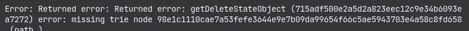

# Xend Finance SDK Setup Examples

Run ganache-cli with the fork of the Binance Smart Chain and an address with BUSD to unlock.
```
ganache-cli --fork https://bsc-dataseed.binance.org/ --unlock 0xd6faf697504075a358524996b132b532cc5D0F14
```

## Next Steps


- Create an `.env` file in this directory, you can see an example from the `env.example` file.

- Copy the unlock address here `0xd6faf697504075a358524996b132b532cc5D0F14` or follow the steps in the SDK documentation to get a new address to be used for the unlocked address and paste in the env as `UNLOCKED_ADDRESS`.

- From the ganache-cli output, copy any private key and paste as `PRIVATE_KEY` in the `.env` file.


## Run Scripts

```
npm run funds && npm start
```

## Possible Issue You Will Encounter

### Error: missing trie node

### Solution
Restart your ganache, copy the update the PRIVATE_KEY and run the scripts again.